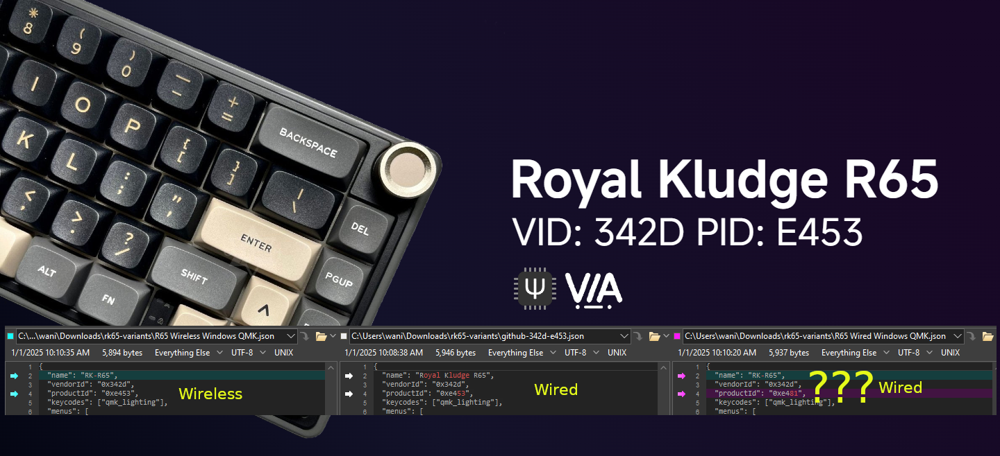

# ⚡ Royal Kludge R65 VIA



I purchased two black wired ansi Royal Kludge R65 keyboards from Amazon and they had a different version of firmware than what [iamdanielv](https://github.com/iamdanielv/kb_rk_r65) and [irfanjmdn](https://github.com/irfanjmdn) had when they purchased theirs. My lsusb output had a product ID (PID) of e481 instead of e453. However, it appears to be the same hardware. I was able to successfully flash my board with their code.

You can take the RK65 apart and compare the hardware info with the PCB info below if you are worried about bricking your keyboard. [This video](https://www.youtube.com/watch?v=OxRa_ZbAYyQ) shows how to take it apart.


My PCB says:

```
130-83905-01
VER: 03
20240319
```

Westberry Processor:

```
WB32F
Q95RCT6
AP3Y429
2423
```

## Relevant Discussions

- https://github.com/iamdanielv/kb_rk_r65/issues/1
- https://github.com/irfanjmdn/r65/discussions/1


# More Details

I am leaving the info below in case it's useful to someone else.

## My Board


Before flashing, lsusb output in normal mode (after flashing, the VID is **e453**, not e481):

```
Bus 002 Device 008: ID 342d:e481 Hangsheng RK-R65
```

lsusb output in dfu mode:

```
Bus 002 Device 009: ID 342d:dfa0 Westberry Tech. WB Device in DFU Mode
```


## Comparison

Both devices share the same Vendor ID (342D) but the Product IDs differ, indicating variations in hardware and/or firmware:


| Name                          | Product ID (PID) | Vendor ID (VID) |
|-------------------------------|-------------------|------------------|
| (mine) Hangsheng RK-R65              | E481              | 342D             |
| (mine) Westberry Tech WB Device      | DFA0              | 342D             |
| Project (irfanjmdn's r65)     | E453              | 342D             |


### JSON files

Now let's look at the json files I see floating around. Adding in the wireless kb as well. Diffs of the jsons can be seen in the extras folder (screenshots)

| Filename | Source | Name | Vendor ID (VID) | Product ID (PID) | Processor | Bootloader | Matrix |
|----------|--------|------|-----------------|------------------|-----------|------------|--------|
| [RK R65 Layout for Via.json](<./RK R65 Layout for Via.json>)       | irfanjmdn (wired)     | Royal Kludge R65 | 342D | E453 | WB32FQ95 | wb32-dfu |   "matrix": {"rows": 5, "cols": 15}, |
| [R65 Wired Windows QMK.json](<./R65 Wired Windows QMK.json>)       | rk website (wired)    | RK-R65           | 342D | E481 | - | - |   "matrix": {"rows": 5, "cols": 15} |
| [R65 Wireless Windows QMK.json](<./R65 Wireless Windows QMK.json>) | rk website (wireless) | RK-R65           | 342D | E453 | - | - | "matrix": {"rows": 5, "cols": 16} |
| - | lsusb (normal mode) | Hangsheng RK-R65 | 342D | E481 | - | - | - |
| - | lsusb (dfu mode) | Westberry Tech WB Device (DFU) | 342D | DFA0 | - | - | - |


#### Observations

- irfanjmdn's wired board has the same VID&PID as the **wireless** board in the json file: [R65 Wireless Windows QMK.json](<./R65 Wireless Windows QMK.json>) even though they have different matrix configurations
- irfanjmdn's wired board has a WB32FQ95 processor & DFU mode on my board says: "Westberry Tech WB Device (DFU)"
- [RK R65 Layout for Via.json](<./RK R65 Layout for Via.json>) and [R65 Wired Windows QMK.json](<./R65 Wired Windows QMK.json>) are nearly identical, except for the name and IDs

## Links

-  R65 65% Wired Gaming Keyboard (QMK/VIA) - "VIA drivers" zip [link](https://cdn.shopify.com/s/files/1/0510/7866/0274/files/VIA_Software_Download_Guide.zip)
